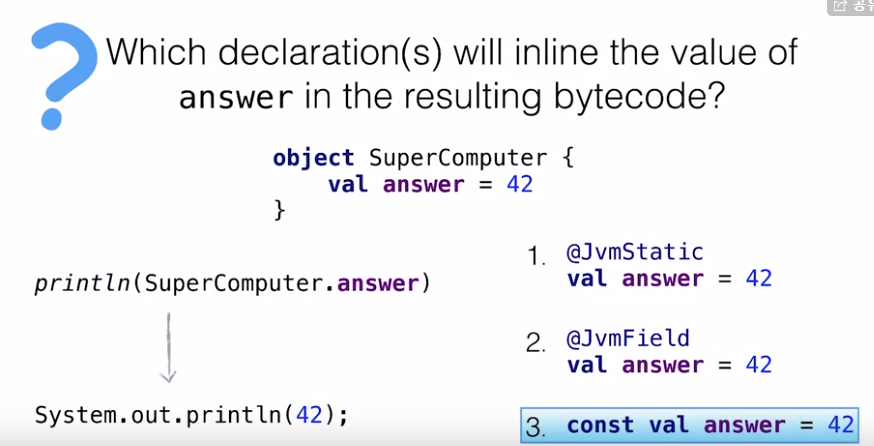
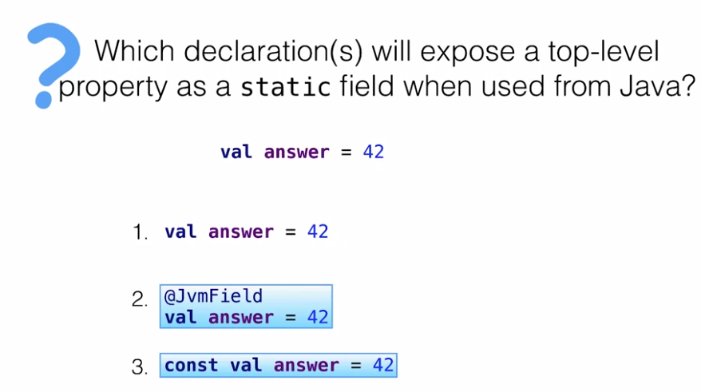
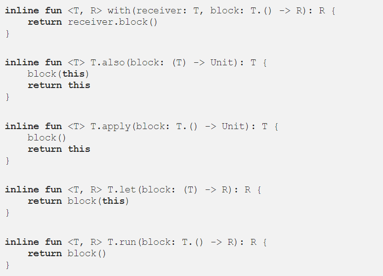
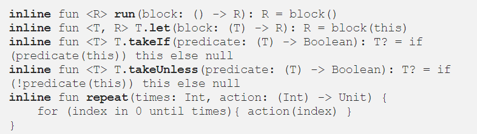
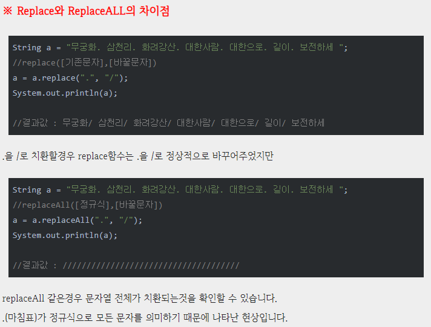

coursera_kotlin

Kotlin In Action 의 저자가 가르키는 코틀린 중급 문법 및 실습에 대한 내용을 정리 하였다.


### Functions

>Kotlin에서는 함수를 Block body, Expression body 중 선택하여 정의할 수 있다.
>
>Kotlin에서 top-level (클래스 외부)에 정의한 함수의 경우 static 함수로 정의되어 있다.

### Named & default arguments

>Named Arguments를 통해 코드의 가독성과 명시성을 높일 수 있으며
>
>parameter를 정의된 것과 다른 순서로 쓰는 것이 가능하다.
>
>이 기능을 Java 코드에서도 사용하고자 할 경우 함수 위에 `@JvmOverloads` 어노테이션을 붙여줘야 한다.

#### Conditionals : if & when

>Java에서는 모든 제어문 (ex: 조건문, 반복문)이 statement이지만, Kotlin에서는 반복문만 제외하고는 모두 Expression이다.
>
>kotlin에서는 swich문을 대신할 when을 사용하며 각 항목에 break;를 하지않아도 된다.
>
>또 한 비교연산자 외에도 형 변환 검사를 하는 is를 통해 타입체크가 가능하다.

### Loops/ ‘in’ checks & ranges

>- Kotlin의 for 문에서 list, map, string을 iterate 할 수 있다. list의 경우 `withIndex()`라는 함수를 통
>
>  해 iterate시에 index값을 사용할 수 있다.
>
>- `..`, `until`, `downTo`, `step`등을 통해 특정 구간을 다양한 방식으로 iterate 할 수 있다.

###  Extension Functions/Examples from the Standard Library

>Kotlin에서 기본적으로 제공하는 대부분의 유용한 함수는 모두 Java의 Class에 대한 Extension (확장함수) 형태로 구현된 것이다. 
>
>예시 : List (`joinToString()`, `getOrNull()`, `withIndex()`), Char (`isLetter()`, `isLetterOrDigit()`)
>
>String (`trimMargin()`, `trimIndent()`, `toRegex()`)
>
> Conversion to numbers (`toInt()`, `toDouble()`, `toIntOrNull()`

#### Calling Extensions

>- Top-level에서 함수를 정의할 경우 Static으로 정의됩니다. 이에 따라 Top-level로 정의된 확장함수는 Static 메소드와 동일한 적용 범위를 가집니다. 
>
>  (관련 링크 : [Kotlin의 Extension은 어떻게 동작하는가 part 1](https://link.medium.com/4tvwpeXuBT))
>
>- 한편 클래스 내부에 멤버 메소드 형태로 확장함수를 정의하는 경우 1) 해당 클래스 내부 멤버 메소드/필드, 2) 해당 클래스 확장함수, 3) Lambda with Recevier 파트에서 배우는 `with` 함수를 통한 접근시에만 접근이 가능하다.

#### Importance of extensions

>Java의 기본 Class 또는 외부 라이브러리에서 제공하는 Class에 대해 고유한 기능으로 동작하는 함수를 추가적으로 정의해야 할 경우 확장함수 형태로 정의하는 것이 권장된다.
>
>해당 Class를 작성했을 때 자동완성 형태로 보여지므로 빠르게 사용할 수 있고, 다른 개발자가 해당 Class에 대해 보다 명확하게 이해하는 데에도 도움을 줄 수 있다.

#### Nullable types

>NPE를 처리하기 위해서는 조건문을 사용하여 명시적으로 null 여부를 체크하거나 
>
>(ex: `if(variable != null) { }`), Safe access expression(`?`)을 쓰거나, Not-null assertion(`!!`)을 사용해야 한다.
>
>한편 조건문을 통해 null 체크한 뒤에 컴파일 에러가 발생하지 않는 것은 smart casts 에 따라 자동으로
>
>Non-nullable로 형변환되기 때문이다.
>
>Safe access expression(`?`)을 쓸 경우 역참조하는 변수가 null인 경우 null을 반환한다. 
>
>이에 대한 디폴트값을 주기 위해서는 Elvis operator(`?:`)를 사용한다. 
>
>Elvis operator는 Groovy 언어에서 영감을 받아 차용된 된 개념이다.
>
>Elvis operator(`?:`)는 Kotlin 연산자 우선순위(Operator precedence)에 따라 동작하므로 다른 연산자와 함께 사용할 때 주의해야 한다.
>
>```kotlin
>val x: Int? = 1
>val y: Int = 2
>val sum = x ?: 0 + y
>println(sum)  // + 연산자가 우선순위가 높기 때문에 (0+y)값 계산이 먼저 된다. 
>//따라서 답은 1이 나온다. 
>```
>
>Not-null assertion(`!!`)의 경우 개발자가 논리적으로 절대 null이 발생할 가능성이 없다고 확신할 때를 제외하면 가능한 피하는 것이 좋다. (먼저 if문으로 null값인지 확인 필요 )
>
> 이는 결국 기존 Java의 문제점인 Run-time 상에서의 NPE를 허용하는 것이기 때문이다. 
>
>하지만 그럼에도 Not-null assertion(`!!`) 이 좋은 것은 Java에 비해 가독성 측면에서 NPE가 발생할 가능성이 있는 지점을 명시적으로 보여주기 때문이다.
>
>Kotlin은 Int, Char, Boolean 등에 대해 Primitive Type과 Wrapper class(Reference Type)를 구분하지 않는
>
>다. Java처럼 `int`와 `Integer`를 구분하지 않으며 오직 `Int`만 가지고 컴파일시에 자동으로 상황에 맞게 
>
>Primitive Type 또는 Wrapper class로 변환한다. 한편, Java에서 Primitive Type은 Null을 가질 수 없으므로 
>
>`Int?`와 같이 Nullable 타입으로 지정하는 경우 컴파일시에 무조건 Wrapper Class로 변환된다.

#### Nullable types under the hood

>Kotlin에서 Nullable type과 Non-nullable type은 Java8에서 도입된 Optional 클래스가 아니라, 
>
>RetentionPolicy.CLASS (런타임시 적용되지 않음)인 Java annotation 형태로 (`@Nullable`,`@NotNull`) 변환되어 적용된다. 
>
>이에 따라 성능 오버헤드가 발생하지 않으며 Null 문제를 해결할 수 있다는 장점이 있다.
>
>- `List<Int?>`는 non-nullable list of nullable values 이고, `List<Int>?`는 nullable list of non-nullable values 이다.
>
>isEmptyOrNull()를 사용할때 앞의 객체에 대해 nullable를 하지 않아도 되는 것이 함수에서 처리해주기 때문 하지만 혼동을 주는것을 방지해야 한다.

#### Checking whether string is null or empty

>- Extension을 정의하는 String은 nullable일까 non-nullable일까? ->nullable

#### Safe casts  & Safe casts

>- Unsafe casts (as) : `as` 키워드는 Type casting 시에 사용되며 캐스팅하려는 변수가 null 또는 다른 타입
>
>  인 경우 컴파일 오류는 발생하지 않지만 런타임시에 ClassCastException이 발생한다.
>
>- Safe casts (as?) : `as?` 키워드는 캐스팅하려는 변수가 null 또는 다른 타입인 경우 null이 반환되며 런타임 오류가 발생하지 않는다.
>
>```kotlin
>val s= if( a is String) a else null
>-> 
>val s: String? = any as? String
>```
>
>```kotlin
>val s="abc"
>    println(s as? Int)
>    println(s as Int?)
>```
>
>위에서의 println 2개의 차이점은  unsafe casts ,Safe casts 의 차이점을 보여준다. 
>
>```kotlin
>val s:Int = 1
>println(s as Int?)
>```
>
>- 위와 같이 s에 대해 명시적으로 Non-nullable Int로 타입을 지정해주더라도 `s as Int?`는 런타임시에 null을 반환하지 않고 동일한 타입으로 인식한다. 
>- Option(옵션)을 사용하면 이런 방식으로 작동하지 않는다.
>- Optional Class와 annotation 방식의 차이라고 보며 코틀린은 여러가지 타입조작이 용이하다.
>- Kotlin은 Nullable/Non-nullable type, 몇 개의 Operator (`?`, `?:`, `!!`, `as?`), smart casts 등 몇가지 기능을 통해 Nullability 문제를 효과적으로 다룰 수 있도록 설계 되었다.
>- Java8에서 도입된 Optional 방식에 비해 Kotlin 방식이 좋은 점은 앞서 언급한 성능 오버헤드 이슈 외에도, 런타임시에 Nullable type과 Non-nullable type이 동일하게 동작하여 변수 할당에 있어 유연하다는 점이다.

#### Lambdas

>Lambda는 인자(argument)를 반환하는 익명함수 이다.
>
>익명함수란 함수명이 없는 함수로 `fun(x:Int):Int = x+1` 형태로 직접 작성할 수 도 있고, Lambda 형태로 작성할 수 도 있습니다.
>
>- Lambda를 사용할 때 아래와 같이 코드를 간소활 수 있습니다.
>
>```kotlin
>//1. 기본 형태 (Lambda expression을 mapValues 확장함수의 인자로 받음)
>pairList.filter({ i:Employee? -> i?.city == "PRAGUE" })
>
>//2. Lambda를 괄호 뒤에 씀 
>employees.filter() { i:Employee? -> i?.city == "PRAGUE" }
>
>//3. 괄호가 비는 경우 괄호 생략 (Groovy 에서 고안하여 검증되었고 차용한 아이디어)
>employees.filter { i:Employee? -> i?.city == "PRAGUE" }
>
>//4. Lambda의 인자 타입 생략 
>employees.filter { i -> i?.city == "PRAGUE" }
>
>//5. Lambda의 인자가 1개인 경우 인자 생략하고 it으로 처리 
>employees.filter { it?.city == "PRAGUE" }
>
>//번외 멀티라인 람다: 마지막 표현식을 반환한다. 
>list.any{println("processing")
>        it >0 
>}
>```
>
>- Lambda가 인자로 Map.Entry나 Pair를 받는 경우 아래와 같이 코드를 간소화할 수 있습니다.
>
>```kotlin
>//1. 기본 형태 
>map.mapValues { entry -> "${entry.value}!"}
>
>//2. Destructuring syntax (인자를 Pair 형태로 명시하여 바로 value 접근 가능)
>map.mapValues { (key, value) -> "$value!"}
>
>//3. 사용되지 않는 인자를 "_" 처리하여 사용되지 않음을 명시 & 네이밍 고민안해도 됨
>map.mapValues { (_, value) -> "$value!" }
>```

#### Common Operations on a collections

>**filter / partition / count**
>
>- filter : Lambda로 정의된 predicate를 만족하는 원소들로 구성된 Collection을 반환하며 만족하는 원소가 없다면 null을 반환.
>
>- map: Lambda로 정의된 식으로 원소들을 람다식에 맞는 값으로 반환
>
>- any , all,none: 람다식에 해당하는 값이 하나라도 있으면 모든 원소가 만족, 모든 원소가 불만족 일때  true 값 반환
>
>- find, first, firstOrNull : 람다식에 해당하는 값 반환 , 첫번째 값 반환 , 만족하는게 없으면 null 반환 
>
> last,lastOrNull : 해당하는 마지막값 반환, 없으면 null 반환 
>
>- partition : Lambda로 정의된 predicate를 만족하는 원소들과, 만족하지 않는 원소들로 나누어 Pair of Collectoins를 반환. 상황에 따라 만족하지 않는 원소들도 필요한 경우 filter 대신 partition 사용.
>
> ```kotlin
> val (youngest, oldest) = heroes.partition { it.age < 30 }
> ```
>
> 
>
>- count: Lambda로 정의된 predicate를 만족하는 원소 개수를 반환.
>
>- groupBy : 람다식에 해당하는 값을 기준으로 원소나누어 Pair of Collectoins를 반환.
>
> associateBy는 람다식 결과값이 같은 중복값을 제거하고 Pair of Collections 값 반환  즉 unique 하지 않을 경우 가장 마지막 원소를 제외하고 지워짐.
>
>- predicate : boolean test(T) 메소드가 정의된 인터페이스로 T 타입 데이터에 대한 특정 조건 부합 여부를 확인하여 bool을 반환
>
>- distinct : 컬렉션에서 중복되는 원소를 제거하고 unique한 원소들만으로 구성된 Collection 으로 반환
>
>- windowed:  리스트나 스트링에서 입력값만큼 크기로 나눈값 제공
>
>  ex) str="abcdefg" str.windowed(4) => [abcd,bcde,cdef,defg] 
>
>- tomap[it.key].toset() 를 줄여서 .keys 로 쓸 수 있다.

#### Operations Quiz 

>- Map에서 key에 해당되는 value를 조회할 때 `map["key"]` 는 해당 key가 없는 경우 null을 반환하며, 
>
> map.getValue("key")` 는 해당 key가 없는 경우 NoSuchElementException을 반환하고, 
>
> map.getOrElse("key") { }` 는 해당 key가 없는 경우 lambda로 정의된 argument를 디폴트값으로 
>
> 하여 반환합니다.
>
>  (lambda 호출과 연산은 key가 없는 경우에만 진행되므로 불필요한 연산을 줄일 수 있습니다.)
>
>- Lambda 속에 Lambda가 중첩되어 사용되거나, 여러 Collection operation 확장함수를 연달아 사용하여 
>
> Lambda가 여러번 사용될 때, it은 의미를 혼동하게할 가능성이 있으므로 인자를 명시적으로 네미밍하는
>
>  것을 장려한다.
>
>- Collection operation은 매우 다양하며 동일한 연산을 위해 가장 간단하고 명확한 operation을 선택해야 
>
> 합니다. 아래 2개 코드는 사실상 동일한 연산이지만 후자가 보다 명료하다.
>
> ```kotlin
>  val (first, second) = heroes
>         .flatMap { heroes.map { hero -> it to hero } }
>         .maxBy { it.first.age - it.second.age }!!
>
>//  argument를 넣어 it을 확실하게 할 것
>  val allPossiblePairs = heroes
>      .flatMap { firstHero ->
>           heroes.map{
>                 secondHero -> firstHero to secondHero
>           }
>      }
> val (oldest,youngest) = allPossiblePairs.maxBy{it.first.age-it.second.age}!!
> //혹은 
> val oldestHero = heroes.maxBy { it.age }
> val youngestHero = heroes.minBy { it.age }
> println(oldestHero?.name)
>         
> ```

#### Function Types

>- Lambda, 명시적인 익명함수 정의, 그리고 다음 강의(5. Member Reference)에서 배울 함수의 reference를 통해 함수를 Variable에 저장할 수 있으며 이 때 Function Type이 정의된다.
>
>  변수 타입 추론과 마찬가지로 타입 추론도 가능합니다.
>
>```kotlin
>val isEven : (Int) -> Boolean = { i : Int -> i % 2 == 0 } 
>val isEven = { i : Int -> i % 2 == 0 } //타입 추론
>```

#### Member References

>앞서 Collection operation에 대해 lambda를 사용한 이유는 operation이 함수
>
> (ex: predicate, 연산을 거친 argument)를 인자로 사용하기 때문이다. 
>
>한편, Kotlin에서 선언적인 function을 variable에 저장하고 인자로 사용할 수 없지만 lambda 외에 function
>
> reference는 variable에 저장하고 인자로 사용할 수 있습니다.
>
>```kotlin
>fun isEven(i:Int):Boolean = i % 2 == 0
>val predicate = isEven // fun을 통해 선언한 함수는 변수에 저장 못하며 오류발생
>val predicate2 = ::isEven // function reference는 변수에 저장 가능 
>val predicate3 = {i:Int -> isEven(i)} // lambda 형태로 변수에 저장 가능
>```
>
>이미 선언된 함수를 인자로 사용하고자 하는 경우 lambda보다 function reference 방식이 보다 코드가 간소화 된다.
>
>```kotlin
>//Android 코드 예시 (정의된 클릭 리스너 함수를 버튼 어댑터에 인자로 넣어야 하는 경우)
>// 1. lambda 방식
>val buttonAdapter = ButtonAdapter(buttons, {button: Button -> buttonClicked(button) })
>// 2. function reference 방식
>val buttonAdapter = ButtonAdapter(buttons, ::buttonClicked)
>```
>
>- Class에 memeber function이 있고 이에 대한 member function reference를 변수에 저장하고자 할 때, 
>
>  Class로 생성한 특정 객체에 대한 member reference를 저장하면 bound reference라 하고, 특정 객체가 
>
>  아닌 Class에 대한 memeber reference 혹은 top-level function의 reference는 non-bound reference
>
>  라고 합니다.
>
>```kotlin
>class Person(val name:String, val age:Int){
>      fun isOlder(ageLimit: Int) = age > ageLimit 
>val jeff = Person("Jeff", 35)
>    
>// 1. bound reference
>val agePredicate = jeff::isOlder
>println(agePredicate(21))
>    
>// 2. non-bound reference (변수에 저장된 함수 호출시 객체를 인자로 넣어야 함) 
>val agePredicate2 = Person::isOlder 
>println(agePredicate2(jeff, 21))
>```

#### Return from Lambda

>Kotlin에서 return은 기본적으로 fun 키워드로 명시된 곳에 대응된다. 
>
>한편, lambda는 fun 키워드로 선언되지 않으므로 lambda내부에 return을 사용할 때 주의해야 한다. 
>
>labeling 또는 return을 사용하지 않는 방법이 있고, local function을 정의하거나, 명시적인 익명함수를 사용하는 방법이 있다.
>
>```kotlin
>/**
>* 1. 아래 코드에서 원소가 0인 경우 해당 원소에 대한 transform 결과물이 []가 되는 
>* 것이 아니라 duplicateNonZero의 반환값이 []가 되어 버림
>*/
>fun duplicateNonZero(list:List<Int>):List<Int>{
>    return list.flatMap {
>        if(it==0) return listOf() 
>        listOf(it, it)
>    }
>}
>// 2. lambda에 l@, @l 라벨링을 통해 return 이 대응되어야 할 지점 설정 
>fun duplicateNonZeroLabel(list:List<Int>):List<Int>{
>    return list.flatMap l@{
>        if(it==0) return@l listOf() 
>        listOf(it, it)
>    }
>} // 혹은 @flatMap으로 사용해도 가능
>// 3. lambda에 return을 사용하지 않음 
>fun duplicateNonZeroNoReturn(list:List<Int>):List<Int>{
>    return list.flatMap {
>        if(it==0) listOf()
>        else listOf(it, it)
>   }
>}
>// 4. local function (fun 키워드 선언)과 function reference를 사용 
>fun duplicateNonZeroLocalFunction(list:List<Int>):List<Int>{
>    fun duplicateNonZeroElement(e: Int): List<Int>{
>        if(e==0) return listOf()
>        return listOf(e, e)
>    }
>    return list.flatMap(::duplicateNonZeroElement)
>}
>// 5. anonymous function을 정의 (fun 키워드 선언)
>fun duplicateNonZeroAnonymousFunction(list:List<Int>):List<Int>{
>    return list.flatMap(fun (e): List<Int>{
>        if(e==0) return listOf()
>        return listOf(e,e)
>    })
>}
>```
>
>- lambda와 명시적인 익명함수는 bytecode level에서는 동일하나 return에 대한 대응 지점만 달라진다.
>
>   (Kotlin이 return을 fun 키워드 기준으로 대응시키는 규칙 때문)

### Properties

>Kotlin은 properties를 기능으로써 지원하여 문법적으로 간결하게 사용할 수 있다.
>
>Kotlin에서 클래스를 정의할 때 클래스 내부에 변수를 val로 정의하면 Read-only property (getter)가, var
>
>로 정의하면 Mutable property (getter/setter)가 자동으로 생성된다.
>
>자바에서는 데이터를 **필드(field)**에 저장한다. `name`과 `isMarried`라는 데이터를 Person클래스의 필드에 저장한 것이다. 한편 각 데이터마다 적용되는 getter와 setter를 **접근자**라 부른다. 이 접근자를 통해서 가시성이 private인 데이터들에 접근할 수 있다.
>
>Kotlin 에서는 필드와 접근자를 통틀어서 **프로퍼티** 라고 부른다. 
>
>##### 주의할 점
>
>>디컴파일한 자바 코드에서 필드가 private이라고 하여 코틀린의 프로퍼티도 private은 아니다. 이게 무슨말인가 싶겠지만, **필드와 프로퍼티를 다르게 인식할 줄 알아야 한다.** 
>>
>>자바는 기본적으로 필드로 다루고, 코틀린은 프로퍼티(필드 + 접근자)를 기본으로 다루는 언어다.
>>
>>만일 프로퍼티가 private 이기 위해서는 
>>
>>```kotlin
>>class Person(private var name: String)
>>```
>>
>>를 디컴파일 자바코드로 보게 되면 
>>
>>```kotlin
>>public final class Property {
>>   private String name;
>>
>>   public Property(@NotNull String name) {
>>      Intrinsics.checkParameterIsNotNull(name, "name");
>>      super();
>>      this.name = name;
>>   }
>>}
>>```
>>
>>getter와 setter가 없어서 프로퍼티가 private이라고 볼 수 있다.
>
>#### Backing Fields
>
>>getter 와 setter를 생략하지 않고 선언하는 방법은 커스텀 접근자를 작성 할 때 backing Field를 사용 할 수 있다.
>>
>>```kotlin
>>class person(){
>>    var id=0
>>    get()=100
>>    var name= "suzuki"
>>    set(value){name=value}
>>}
>>```
>>
>>코드가 무난 한 것 같지만 디 컴파일을 해보면 this.setName(value)로 나오는 것을 보고 무한루프를 도는 것을 알 수 있다. 따라서 위의 코드를
>>
>>```kotlin
>>class person(){
>>    var id=0
>>    get()=100
>>    var name= "suzuki"
>>    set(value){field=value}
>>}
>>```
>>
>>backing Field를 사용하여 set함수를 적용한다. 
>
>Kotlin에서는 field 정의시 자동으로 accessor가 구현되어 클래스 외부에서는 field에 직접적으로 접근할 수 
>
>없도록 한다. `<객체명>.<필드명>` 형태로 접근하더라도 Kotlin 컴파일러가 **자동으로 getter/setter로 변환**
>
>**한다**. 하지만 클래스 내부의 accessor에서 `field` 키워드를 사용한 경우에는 field에 직접적인 접근이 가
>
>능하다. (아래 코드 참고) 또한, 클래스 내부 메소드에서 `<객체명>.<필드명>` 형태로 접근한 경우 accesso
>
>r를 커스터마이징한 경우 accessor로 (ex: `this.setState()`), 커스터마이징 하지 않은 경우 field로 (ex: 
>
>`this.state`) Kotlin 컴파일러가 선택적으로 변환합니다.
>
>```kotlin
>class StateLogger {
>var state = false
>   set(value) {
>       // accessor 내부에서 field 키워드로 접근시 Java코드상에서 
>       // this.state가 호출된다. 
>       println("state has changed: $field -> $value")
>       field = value
>   }
>
>fun printState(){
>   // 클래스 내부 메소드에서 field에 접근시 
>   // getter는 커스터마이징하지 않았으므로, this.state가 호출된다.               
>  println("$state")
>}
>fun setOppositeState(bool: Boolean){
>    // setter는 커스터마이징 했으므로, this.setState()가 호출된다. 
>   state = !bool
>}
>}
>```
>
>val은 엄밀히 따지면 read-only (reassign이 안됨) 를 뜻하는 것이며, immutable한 것은 아니다. 
>
>val로 선언한 properties는 mutable(unstable) 할 수 있다.
>
>getter 호출시마다 값이 달라지는 사례 : Random 함수를 쓰는 경우, 
>
>getter 내부에 field의 값을 변경시키는 로직을 넣는 경우

## More about properties

>Interface에도 Property를 정의할 수 있는데, 이는 컴파일시에 구현되지 않은 accessor 메소드
>
>(val의 경우 getter only, var의 경우 getter&setter)들로 변환된다.
>
>interface smart casts 기능이 동작하지 않는 3가지 상황이 존재한다. 
>
>1) interface 타입인 properties의 getter를 커스터마이징한 경우, 위 *Unstable val 실습 코드 작성시 고려할 점* 에서 살펴본 것처럼 getter 호출시마다 값이 mutable할 수 있는데 이 경우 타입 체크를 했더라도 다시 호출할 경우 다른 구현 class 타입이 반환될 가능성이 있으므로 동일 타입을 보장할 수 없다. 
>
>2) interface 에서 interface 타입 properties를 정의한 경우 해당 properties의 accessor 메소드는 open이며 재정의 과정에서 getter가 커스터마이징되어 1)과 동일한 이슈가 발생할 수 있다. 
>
>3) interface 타입 properties를 mutable로 선언한 경우 setter를 통해 값이 변경될 가능성이 있다. (아래 코드 참고) 이 경우에 대한 방안은 local variable에 getter 메소드 반환 값을 저장하여 사용하는 것이다.
>
>```kotlin
>// 아래에 정의한 User interface를 properties로 사용하는 경우 
>interface User {
>val nickname: String
>}
>// 1. Interface 타입의 property의 getter를 커스텀한 경우 
>class SessionI{
>val user: User
>   get(){
>       return TODO()
>   }
>}
>// 2. Interface에서 Interface 타입 property를 정의한 경우 
>interface SessionII{
>val user: User 
>}
>// 3. Interface 타입의 property를 mutable(var)로 선언한 경우 
>class SessionIII(var user:User)
>
>fun analyzeUserSession(session: Session, sessionII: SessionII, sessionIII: SessionIII){
>/*
>아래 println 두줄 모두 is a property that has open or custom getter      메시지와 함께 오류가 뜸
>*/
>if(session.user is FacebookUser){
>   println(session.user.accountId)  
>}
>if(sessionII.user is FacebookUser){
>   println(sessionII.user.accountId)
>}
>
>//아래 println 의 경우 is a mutable property that could have been changed by this 		time 메시지와 함께 오류가 뜸
>
>if(sessionIII.user is Facebookuser){
>   println(sessionIII.user.accountId)
>}
>// 아래처럼 local variable에 getter의 값을 저장하는 경우 smart casts 동작
>val userI = session.user
>if (userI is FacebookUser) { println(userI.accountId) }
>val userII = sessionII.user
>if (userII is FacebookUser) { println(userII.accountId) }
>val userIII = sessionIII.user
>if (userIII is FacebookUser) { println(userIII.accountId) }
>}
>```
>
>```kotlin
>interface User {
>    val nickname: String
>}
>// 1번. 주 생성자 안에 프로퍼티를 직접 선언함
>class PrivateUser(override val nickname: String) : User
>
>// 2번. 커스텀 게터로 프로퍼티를 설정함.
>class SubscribingUser(val email: String) : User {
>    override val nickname: String
>        get() = email.substringBefore('@')
>}
>
>// 3번. 초기화 식으로 프로퍼티 값을 설정함.
>class FacebookUser(val accountId: Int) : User {
>    override val nickname = getFacebookName(accountId)
>}
>```
>
>여기서 2번 SubsribingUser와 3번 FacebookUser를 구현하는 방법의 차이에 주의해야 한다. 
>
>SubscribingUser의 nickname 프로퍼티는 매번 호출될때마다 substringBefore를 호출하여 계산하는 커스텀 게터를 활용한다.
>
>이와 다르게 FacebookUser의 nickname 프로퍼티는 객체를 초기화할 때 계산한 데이터를 뒷받침하는 필드(backing fields)에 저장했다가 불러오는 방식을 활용한다.

#### **Extension properties** 

>확장 함수는 해당 클래스에 대해 빈번히 사용되는 연산 작업이며, 확장 프로퍼티는 해당 클래스에 대해 빈번히 사용되는 정보와 속성을 저장한다.
>
>```kotlin
>// 특정 String 타입 객체의 마지막 index값을 반환하는 lastIndex 확장프로퍼티 
>val String.lastIndex : Int
>    get() = this.length - 1
>// 특정 StringBuilder 타입 객체의 마지막 글자를 반환하고, 마지막 글자를 재할당할 수 // 있는 lastChar 확장 프로퍼티
>var StringBuilder.lastChar: Char
>    get() = get(this.length - 1)
>    set(value: Char){
>        this.setCharAt(length-1, value)
>    }
>```

#### Lazy or late initialization

>Kotlin에서는 `by lazy` 키워드를 통해 Lazy Properties를 정의할 수 있다.
>
>1) lambda를 run 통해 실행시키는 경우 변수 호출 여부와 무관하게 무조건 연산을 수행하여 반환 값을
>
>​	 저장한다. ( 부르지 않아도 실행)
>
>2) property의 경우 호출되기 전까지는 실행되지 않지만, 호출 시마다 매번 연산이 수행된다. 
>
>3) lazy property의 경우 호출되기 전까지는 실행되지 않으며, 최초 1회 호출시에만 연산이 수행되고 반환 값을 저장한다.
>
>```kotlin
>// 1. lambda를 run을 통해 실행시키는 경우
>val ValueI : String = run {
>println("computed! - run lambda")
>"Hello"
>}
>// 2. property를 사용하는 경우 
>val ValueII : String
>get() {
>   println("computed! - property")
>   return "Hello"
>}
>// 3. lazy property를 사용하는 경우
>val ValueIII : String by lazy {
>println("computed! - lazy property")
>"Hello"
>}
>```

**Late initialization**

>- 특정한 목적에 따라 Property를 클래스 생성자 (Constructor)가 아니라 특정한 다른 지점에서 초기화해야 하는 상황에 유용한 기능이다. 사용되는 예시로 안드로이드 액티비티, JUnit 테스트, 의존성 주입 등이 있다. (관련 링크 : [Medium 블로그](https://medium.com/til-kotlin-ko/kotlin-delegated-property-by-lazy는-어떻게-동작하는가-74912d3e9c56) 중 lateinit 부분)
>- 이러한 상황에 대한 Java 대응 방식은 생성자에서 우선 null로 초기화했다가 추후 특정 지점에서 다시 재할당하는 방식이다. 하지만 이 경우 해당 변수를 Nullable type으로 선언해야 하며 이로인해 이 변수를 다루는 과정에서 계속 Nullability 관련 연산자를 사용해야 하는 비효율성이 발생한다. 이 경우 변수 앞에 `lateinit` 키워드를 써주면 Non-nullable 타입으로 처리할 수 있다.
>- Late initialization은 사실 변수 선언시 null로 초기화했다가, 개발자가 실제로 유의미한 초기화를 하는 특정 지점에서 다시 재할당을 하는 방식으로 컴파일 된다. 이에 따라 `lateinit` 키워드는 `val` 키워드에는 사용할 수 없도록 언어적으로 제한되어 있다.
>- Late initialization은 불필요한 Nullability 관련 코드를 제거해주는 목적의 문법이므로 `lateinit` 키워드로 선언된 변수는 Nullable type이 될 수 없도록 제한되어 있다. 또한 Primitive type (Int, Boolean, Char 등)의 경우 개발자가 구현하는 의도에 맞춘 디폴트 값을 주는 것이 가능하므로 (ex: 0, false, ‘’ 등) `lateinit` 키워드를 사용할 수없도록 제한되어 있습니다.
>- `lateinit` 키워드로 선언된 변수의 초기화 여부를 `.isInitialized`를 통해 체크할 수 있다. 이는 컴파일 과정에서 null 여부를 확인하는 if 조건문으로 구현됩니다.
>- 위와 같이 late initialization은 사실상 Java 방식과 동일하게 동작한다. 다만, 실용적 관점에서 클래스 생성자가 아닌 특정 지점에서만 변수 초기화가 가능하고, 실제로 해당 변수는 그 지점 이후에만 역참조되는 경우들이 있는데 (ex: 안드로이드 액티비티 onCreate) 이 때 단순 반복적인 코드를 Kotlin 컴파일러 레벨에서 자동으로 생성해주어 Kotlin 코드 간결성을 개선해 준다는 의미가 있다.

#### lateinit 유의사항

>late initialization은 앞서 배운 Non-null assertion (`!!` )과 유사하게 개발자가 해당 변수가 반드시 초기화 이후에 역참조될 것이라는 확신이 있을 때만 사용해야 하는 것으로, (ex: 안드로이드 액티비 onCreate) 초기화 전에 역참조가 발생할 경우 UninitializedPropertyAccessException 이라는 런타임 에러가 발생한다.
>
> 다만, NullPointerException과 달리 에러 문구에서 정확히 어떤 변수에서 문제가 발생했는지 명시적으로 알려주므로 오류 수정시 상대적으로 용이하다는 장점이 있다.
>

#### OOP in Kotlin

>Kotlin은 public, protected, internal, private의 4가지 수준이 존재하며, 디폴트는 public이다.
>
>```kotlin
>class Person
>internal constructor(name: String, age:Int){ //생성자에 대한 가시성을 변경하는 문법
>    val name:String
>    var age:Int
>    init {
>        this.name = name
>        this.age = age
>    }
>    
>    constructor(name: String, birthYear:Int, nowYear:Int) : this (name, nowYear-birthYear+1)
>}
>// 아래와 같이 상황에 따라 다른 매개변수 유형과 개수로 객체 생성 가능 
>val person1 = Person("kevin", 28)
>val person2 = Person("kevin", birthYear = 1992, nowYear = 2001)
>```
>
>생성자 오버로딩 (생성자 매개변수의 유형과 개수를 다르게 하는 여러 생성자를 구현하는 것) 이 필요한 경우 클래스 내부에 `constructor` 를 통해 Secondary Constructor를 정의할 수 있다. 
>
>단, secondary constructor 는 반드시 Primary constructor 또는 다른 secondary constructor를 호출해야 한다.
>
>Java에서 상속관계인 클래스들의 생성자 호출 순서는 자식클래스 생성자 호출시 우선 부모클래스 생성자가 호출되며 부모클래스 생성자 내부 로직 실행 -> 자식 클래스 생성자 내부 로직 실행의 순서로 실행된다.

#### Class modifiers — I, II

>**Enum class**
>
>>- Enum은 Enumeration (목록)을 의미하며, Java와 동일하게 고정된 갯수의 값들로 구성된 목록이 필요할 때 사용한다.
>>
>>```kotlin
>>import Color.*// 색상 목록의 각 색상 항목마다 서로 다른 r, g, b 속성 정보를 가짐 -> 프로퍼티로 구현
>>enum class Color(val r:Int, val g:Int, val b:Int){
>>    BLUE(0,0,255),
>>    ORANGE(255,165,0),
>>    RED(255,0,0); // 세미콜론을 통해 Enum list와 member list를 구분// 색상 목록의 각 색상 항목마다 rgb값을 구하는 연산이 필요 -> 메소드로 구현
>>    fun rgb() = (r * 256 + g) * 256 + b
>>}fun main(args: Array<String>){
>>    println(BLUE.r)
>>    println(BLUE.rgb())
>>}
>>```
>>
>>메소드는 목록의 각 항목에 대해 빈번하게 수행되는 연산이 있는 경우 유용하다.
>
>**data class**
>
>>Kotlin에서 `==`연산자는 컴파일 과정에서 `equals()` 메소드로 변환되며, `===` 연산자가 reference equality를 체크한다. 
>>
>>한편 개발자가 직접 구현하는 클래스의 경우 의도에 적합하도록 `equals()` 를 재정의해주어야 하는데 data class로 선언하는 경우 자동적으로 구성 요소가 모두 동일한지 비교하는 메소드를 생성해 준다.
>
>**Sealed class**
>
>>Sealed class는 고정된 상속 계층 구조를 가지는 클래스를 다룰 때 사용한다. 
>>
>>선언된 상속클래스 외에 다른 클래스가 없음을 보장하므로, Enum class 처럼 `when` expression 을 사용할 때 불필요한 `else` 분기를 만들지 않아도 되어 코드를 간결하게 만들 수 있다.
>
>**Inner/ nested class**
>
>>일반적인 유스케이스에서 내부에 선언된 클래스가 외부 클래스에 대한 역참조를 필요로 하지 않는 경우가 많고, 이 경우 불필요한 메모리 누수를 줄이기 위해 정적 중첩 클래스가 낫기 때문이다.
>>
>>물론 상황에 따라 해당하는 클래스를 사용하면 된다.

#### **Class delegation**

>인터페이스에 구현되지 않은 메소드들이 있고, 
>
>클래스에서 이 인터페이스를 프로퍼티로 사용할 경우 클래스 구현 과정에서 메소드를 구현할 필요 없이 추후 클래스 객체 생성시에 인자로 받을 인터페이스 구현체에게 메소드 구현을 위임할 수 있다. 
>
>```kotlin
>interface Repository{
>    fun getById(id: Int): Customer
>    fun getAll() : List<Customer>
>}interface Logger{
>    fun logAll()
>}class Controller(
>    val repository: Repository, 
>    val logger: Logger
>) : Repository, Logger {
>    override fun getById(id: Int): Customer = repository.getById(id)
>    override fun getAll(): List<Customer> = repository.getAll()
>    override fun logAll() = logger.logAll()
>}
>```
>
>위 코드 처럼 모든 위임 메소드 (delegating methods)를 직접 코딩하는 것은 번거로운 단순 작업이다. 이 경우에 대해 Kotlin은 Class delegation 을 지원하며 `by` 키워드를 사용하면 컴파일 과정에서 위임 메소드를 자동으로 생성해주어 코드를 간결하게 만들 수 있다.
>
>```kotlin
>class Controller(
>    val repository: Repository, 
>    val logger: Logger
>) : Repository by repository, Logger by logger
>```
>
>위임 클래스를 통해 코드를 간결하게 만들수 있다. 

#### Objects, object expressions & companion objects

>`**object**` **키워드와 object declaration**
>
>>```kotlin
>>// Java 코드에서 싱글톤 패턴 구현
>>public class JSingleton {
>>public static final JSingleton INSTANCE = new JSingleton();
>>private JSingleton() { }
>>public void foo() { System.out.println("foo"); } 
>>}
>>// Java 싱글톤패턴 객체 멤버 호출 방법
>>JSingleton.INSTANCE.foo();
>>
>>// 위와 동일하게 동작하는 Kotlin 코드 
>>object KSingleton {
>>fun foo() { println("foo") }
>>}
>>// Kotlin 싱글톤 패턴 객체 멤버 호출 방법
>>KSingleton.foo()
>>```
>>
>>Java에서는 싱글톤 패턴을 사용하기 위해 관용적인 단순 코드 작성 작업이 필요하다.
>>
>>한편, Kotlin은 `object` 키워드를 쓰면 컴파일 과정에서 싱글톤 패턴을 위한 코드를 자동으로 생성해주고, 관용적인 `INSTANCE` 필드 호출을 생략해주어 코드 간결성을 높일 수 있다.
>
>**object expression**
>
>>Kotlin에서 구현할 인터페이스가 오직 1개의 추상 메소드 (abstract method)만 가질 경우 lambda로 구현할 수 있다. 
>>
>>인터페이스가 여러개의 추상 메소드를 가질 경우 object expression으로 구현할 수 있다.
>>
>>object expression도 `object :` 키워드를 사용하지만 이 때 생성되는 객체는 호출시마다 매번 새롭게 생성되며 앞선 싱글톤 패턴 (object declaration)과 무관하다.
>>
>>익명(이름없는) 오브젝트 (anonymous object) 는 local 과 private 선언에서만 type 으로써 사용될 수 있다.
>>
>>익명 오브젝트 (anonymous object) 를 public 함수의 리턴 타입으로 쓰거나 public property 의 타입으로 쓰면 둘의 실제 타입은 anonymous object 의 선언된 supertype 되거나, supertype 을 선언 안한 경우엔 **Any** 이 되게 된다.
>>
>>anonymous object 에 추가된 멤버들은 접근이 불가능 해 진다.
>>
>>```kotlin
>>class C { 
>>    // Private function, so the return type is the anonymous object type private
>>    fun foo() = object { val x: String = "x" } 
>>    // Public function, so the return type is Any
>>    fun publicFoo() = object { val x: String = "x" } 
>>    fun bar() { val x1 = foo().x // Works 
>>               val x2 = publicFoo().x // ERROR: Unresolved reference 'x' } }
>>
>>
>>```

**No static keyword**

>**@JvmStatic**
>
>> companion object를 통한 외부클래스 내부의 싱글톤 패턴 클래스는 사실
>>
>> `<외부 클래스명>.Companion.<멤버>` 를 Kotlin 컴파일러가 `<외부 클래스명>.<멤버>`로 간소화하여 
>>
>> 사용할 수 있도록 하는 것이다. 
>>
>> 따라서 해당 Kotlin 코드를 Java에서 사용할 경우 Kotlin 코드와 달리 `.INSTANCE` , `.Companion` 작성이 필요하다.
>>
>> 이는 Java 상호운용성 측면에서 혼동의 여지가 있으며, object/companion object 내부의 멤버에 대해 `@JvmStatic` 어노테이션을 붙이면 Java에서도 Kotlin과 동일한 코드로 사용할 수 있다.
>>
>> 즉  `@JvmStatic`는 Companion에 등록된 변수를 자바의 static처럼 선언하기 위한 annotation이다.
>
>**Inner object (Inner modifier with object)**
>
>>외부클래스 내부 object에 대해서는 `inner` 제어자를 사용할 수 없다. 
>>
>>왜냐하면 `inner` 제어자는 non-static nested class를 의미하는데, object는 싱글톤 패턴 클래스로 static 이어서 상충되기 때문이다.
>
>#### Constants
>
>>상수 (constants)로서 클래스 멤버 변수란 해당클래스에 대해 고정된 값을 가지는 속성을 의미한다.
>>
>> (ex: 원주율) 상수는 각 객체에 종속되지 않고 동일한 값을 가져야 하며, 한번만 초기화 되어야 하므로 Java에서는 static과 fianl을 통해 구현한다. 
>>
>>Kotlin 에서는 `const` 제어자 또는 `@JvmField` 어노테이션을 통해 상수를 구현한다. 
>>
>>`const` 제어자를 사용하면 컴파일 과정에서 상수 변수를 해당 값으로 치환하며 (단, Primitive type 또는 String에 대해서만 동작), 
>>
>>`@JvmField` 어노테이션을 사용하면 프로퍼티를 accessor를 통해서가 아니라 직접 필드에 접근할 수 있도록 하는 방식으로 mutability를 차단하여 상수를 구현한다.
>
>
>
>
>
>

### Generics

>JVM의 제네릭은 보통 타입 소거를 사용해 구현된다. 즉 실행 시점에 제네릭 클래스의 인스턴스에 타입 인자 정보가 들어있지 않다는 뜻이다.
>
>코틀린 타입 소거가 어떤 장점을 가지는지 살펴보고 함수를 `inline`으로 선언함으로써 이런 제약을 어떻게 피할 수 있는지 알 수 있다.. 함수를 `inline`으로 만들면 타입 인자가 지워지지 않게 할 수 있다 (실체화)
>
>이러한 제너릭이 타입인자 검사나 변환할 시에 error를 표출하지만 저장해야 하는 타입 정보의 크기가 줄어들어서 메모리 사용량이 줄어든다는 나름의 장점이 존재힌다. 
>
>어떤 값이 집합이나 맵이 아니라 리스트라는 사실을 확인하는 방법은 **스타 프로젝션**을 사용하면 된다.
>
>즉 리스트인지 Map,Set인지를 구분하려면 사용한다.
>
>
>
>하지만 타입 인자가 다른 타입으로 캐스팅해도 여전히 캐스팅에 성공하게 된다는 문제가 있다.
>
>`inline` 함수 안에서는 타입 인자를 사용하여 함수의 본문에서 그 함수의 타입 인자를 가르킬 수 있어서 이 문제를 해결할 수 있다.
>
>인라인 함수의 본문을 구현한 바이트코드를 그 함수가 호출되는 모든 지점에 삽입합니다. 컴파일러는 실체화한 타입 인자를 사용하여 인라인 함수를 호출하는 가 부분의 정확한 타입 인자를 알 수 있게 된다.
>
>inline 과 reified 를 같이 사용하여 런타임시에 타입 파라미터를 얻을 수 있다.
>
>```kotlin
>//명시적으로 Class 파라미터 전달
>fun <T : Any> String.toKotlinObject(c: KClass<T>): T {
>  val mapper = jacksonObjectMapper()
>  return mapper.readValue(this, c.java)
>}
>data class Foo(val name: String)
>
>val json = """{"name":"example"}"""
>json.toKotlinObject(Foo::class)
>// reified 사용
>inline fun <reified T : Any> String.toKotlinObject(): T {
>  val mapper = jacksonObjectMapper()
>  return mapper.readValue(this, T::class.java)
>}
>json.toKotlinObject<Foo>()
>```
>
>✅ 다음과 같은 경우엔 실체화한 타입 파라미터를 사용할 수 있다.
>
>- 타입 검사와 캐스팅 (`is`, `!is`, `as`, `as?`)
>- 코틀린 리플렉션 API(`::class`)
>- 코틀린 타입에 대응하는 java.lang.Class를 얻기(`::class.java`)
>- 다른 함수를 호출할 때 타입 인자로 사용
>
>####  Non-Null Type parameter 설정
>
>>코틀린에서 타입의 기본은 Non null 입니다.
>>
>>다만 제너릭인 경우에만 기본값이 Nullable 이다.
>>
>>만약 null값을 허용하게 하지 않으려면 <T : Any>로 non-nullable로 설정하면 된다.

####  Operator overloading

>Kotlin의 Conventions 란 언어의 내재된 구조처럼 보이는 기능 (ex: 산술 이항/단항 연산자, 할당 연산자, 비교 연산자, `in` , `..` , iterator, destruction declaration 등)이 수행하는 역할을 메소드로 정의하므로써, 직접 구현한 클래스 또는 기존 클래스에 대해 이러한 기능을 오버로딩하여 사용할 수 있도록 하는 것이다. 
>
>이를 통해 빈번하게 사용되는 기능을 직관적이고 간결한 문법으로 사용할 수 있도록 한다.
>
>산술 연산자의 경우 `a + b` 는 `a.plus(b)` , `a — b` 는 `a.minus(b)` , `a * b`는 `a.times(b)` , `a / b` 는 `a.div(b)` , `a % b` 는 `a.mod(b)` 로 대응된다.
>
>단한 연산자의 경우 `+a` 는 `a.unaryPlus()` , `-a` 는 `a.unaryMinus()` , `!a`는 `a.not()` , `++a/a++` 는 `a.inc()` , `--a/a--` 는 `a.dec()` 로 대응된다.

#### Conventions

>비교 연산자의 경우 `a > b` 는 `a.compareTo(b)> 0`, `a < b` 는 `a.compareTo(b)< 0`,`a >= b` 는`a.compareTo(b)>= 0`, `a =< b` 는 `a.compareTo(b) <= 0`,`a == b. `는`a.equals(b)`로 대응된다.
>
>For 루프를 통해 Iterator를 구현하는 `for (c in a) { }` 는 `a.iterator()`에 대응된다. 
>
>Kotlin의 String이 Iterable 인터페이스를 구현하지 않은 Java.lang.String을 사용하면서도 이터레이트가 가능한 것은 이러한 구현 방식 때문이다.
>
>
>
>For 루프와 lambda에서 사용하는 destruction declaration 문법의 경우 `val (a, b) = p` 는 `val a = p.component1()` 과 `val b = p.component2()`대응된다. 
>
>data class의 경우 이 `component()` 메소드를 자동으로 생성하기 때문에 destruction declaration을 사용할 수 있다. 한편, destruction declaration 문법을 사용할 때 호출하지 않는 변수는 `_` 선언을 통해 사용되지 않음을 명시화할 수 있다.

#### inline function

>
>
>
>
>
>
>#### let **함수**
>
>>`.let { ... }` 형태의 사용 방식은 함수 인자 (argument)로 사용되는 변수에 대한 null 체크 때에도 사용할 수 있다. 
>>
>>즉 지정된 값이  null이 아닌 경우에 코드를 실행하는 경우이다.
>>
>>```kotlin
>>// 명시적으로 null 체크하고 함수 인자로 사용하는 방식
>>val str = getStr()
>>if (str != null){
>>    function1(str)
>>    function2(str)
>>}// ?.let{ ... }을 통해 null 체크하고 함수 인자로 사용하는 방식 
>>getStr()?.let{
>>    function1(it)
>>    function2(it)
>>}
>>```
>>
>>앞에서 배운 인터페이스 smart cast가 안되서 지역변수에 할당하고 형 체크 하는 방식을 인라인 함수로 간결하게 나타낼 수 있다. 
>>
>>```kotlin
>>interface User { val nickname: String }
>>interface Session { val user: User }
>>class FacebookUser(val accountId: Int) : User {
>>    override val nickname = getFacebookName(accountId)
>>    fun getFacebookName(accountId: Int):String = TODO()
>>}
>>class SubscribingUser(val email: String) : User {
>>    override val nickname: String
>>        get() = email.substringBefore('@')
>>}// 1. as?를 통한 타입 체크
>>// 멤버 접근시에만 사용 가능
>>(session.user as? FacebookUser)?.accountId// 2. 명시적 타입 체크 (is)
>>// 인터페이스 프로퍼티의 경우 open or custom getter 이슈 
>>// 때문에 smart cast가 되지 않아서 3번 처럼 사용해야함.
>>if(session.user is FacebookUser){ println(session.user.accountId) }// 3. 인터페이스 프로퍼티 타입 체크를 위한 변수 할당
>>val user = session.user
>>if(user is FacebookUser) { println(user.accounId) }// 4. let을 사용한 변수 할당 없는 인터페이스 프로퍼티 타입 체크
>>(session.user as? FacebookUser)?.let{ println(it.accountId) }
>>```
>
>#### takeUnless , takeif
>
>>간단한  takeIf, takeUnless 구문이다. 
>>
>>```kotlin
>>// 원본 코드
>>if (status) { doThis() }// 수정 된 코드
>>takeIf { status }?.apply { doThis() }
>>```
>>
>>하지만 위에 식은 극단적인 표현이기도 하며 확장함수의 의미를 살리지 못한다.
>>
>>takeIf 의 조건 함수 predicate 는 파라미터로 T 객체를 전달 받는다.
>>
>>takeIf 의 조건 함수 predicate 의 결과에 따라 T 객체 인 자기 자신 (this) 이나 null 을 반환한다.
>>
>>```kotlin
>>public inline fun <T> T.takeUnless(predicate: (T) -> Boolean): T? 
>>    = if (!predicate(this)) this else null
>>```
>>
>>```kotlin
>>// 원본 코드
>>if (someObject != null && someObject.status) {
>>   doThis()
>>}
>>// 나아진 코드
>>if (someObject?.status == true) {
>>   doThis()
>>}
>>// 개선 된 코드
>>someObject?.takeIf{ it.status }?.apply{ doThis() }
>>```
>>
>> takeIf 함수가 조건이 만족하지 않으면 null 을 반환하는 특성을 이용하여 어떤 데이터를 반환 하거나 
>>
>>엘비스 연산자 (?:) 를 사용해서 함수를 종료하는 방법으로 사용할수도 있다.
>>
>>```kotlin
>>// takeIf 의 조건이 만족되지 않으면 에러를 던집니다.
>>val index 
>>   = input.indexOf(keyword).takeIf { it >= 0 } ?: error("Error")// takeIf 의 조건이 만족되지 않으면 return 하여 종료 합니다.
>>val outFile 
>>   = File(outputDir.path).takeIf { it.exists() } ?: return false
>>```
>>
>>takeif{}?.apply 에서 ? 를 꼭 사용해야한다.

#### The power of inline

>**Regular non-inlined lambda**
>
>>inline 키워드없이 정의된 일반적인 함수들은 lambda를 인자로 받고 이 lambda가 어떠한 변수라도 포함
>>
>>할 경우, lambda에 대응되는 익명 클래스 객체 (anonymous class object)를 생성하며 이는 퍼포먼스 오버
>>
>>헤드를 발생시킨다.
>>
>>즉 non-inline 형태로 `run` 함수를 정의한 경우, 그냥 코드 블록을 수행시키는 것에 비해, `run`함수를 통해
>>
>> 코드 블록 (lambda)을 수행시키는 것은 익명 클래스 생성에 따른 부가 비용으로 인해 퍼포먼스 측면에서
>>
>> 덜 효율적이다.
>
>**Inline functions**
>
>>어떤 함수를 `inline` 으로 선언하는 경우 그 함수의 본문이 inline 됩니다. 이 말의 뜻은 해당 함수를 호출하
>>
>>는 코드를 컴파일 할 때, 해당 함수를 호출하는 바이트 코드로 컴파일하는 것이 아니라 해당 함수 본문에 대
>>
>>한 바이트 코드로 컴파일한다는 뜻이다. 
>>
>>즉 `run` 함수를 `inline` 형태로 정의한 경우, 그냥 코드 블록을 수행시키는 것과, 
>>
>>`run`함수를 통해 코드 블록 (lambda)을 수행시키는 것은 바이트코드 레벨에서 동일하게 동작한다.
>>
>>```kotlin
>>// 1. try-with-resource에 대한 Java 스타일 코드
>>try{
>>    val br = BufferedReader(FileReader(path))
>>    return br.readLine()
>>} catch (e: IOException){
>>    throw e
>>}
>>// 2. use 인라인함수 사용 
>>BufferedReader(FileReader(path)).use { br ->
>>    return br.readLine()
>>}
>>```
>>
>>하지만 Kotlin은 이러한 동작을 하는 코드 블록을 `use` 라는 인라인 형태의 라이브러리 함수로 제공하여 
>>
>>퍼포먼스 오버헤드 없이 간결하게 작성할 수 있다.
>
>**Inline functions의 Java 상호운용성**
>
>>컴파일 과정에서 인라이닝은 Kotlin 컴파일러가 하는 것이기 때문에, Java 코드에서 Kotlin 의 인라인 함수를 사용할 경우 사용은 가능하지만 컴파일시 인라이닝 처리는 동작하지 않는다.
>>
>>이에 따라 대부분의 인라인 라이브러리 함수는 `@InlineOnly` 어노테이션이 포함되어 있는데 이는 오직 인라인으로만 사용할 수 있다는 뜻으로, Java 코드에서 해당 인라인 함수에 접근할 수 없도록 (=Kotlin에서만 해당 함수를 사용할 수 있도록) 가시성을 제어하는 어노테이션이다.
>
>#### Inline or not inline?
>
>>일반적인 non-inline 함수 호출 방식은 JVM이 바이트코드를 Just-in-time 컴파일하는 과정에서 최적화가 지원된다. 
>>
>>그에 비해 `inline` 함수는 바이트코드에 함수 본문이 그대로 복사되기 때문에 JVM 최적화가 불가능하며 코드 중복이 발생한다.
>>
>>Lambda를 인자로 받는 경우에는 익명 클래스 객체가 생성되는 명백한 퍼포먼스 오버헤드가 있으므로 `inline` 함수를 사용하는 것이 이점을 줄 수 있다. 
>>
>>(현재의 JVM은 함수 호출과 람다를 인라이닝해줄 정도로 똑똑하지는 못하기 때문이다.)
>>
>>이에 따라, Lambda (ex: `run`의 경우 code block, `filter`의 경우 predicate, `map`의 경우 transform 등)를 인자로 받는 코드 사이즈가 작은 로직 중 높은 빈도로 재사용되는 경우 (ex: `run`, `let`, `takeif`, `takeUnless`, `repeat`, `filter`, `map` 등)만 `inline` 함수로 정의하는게 퍼포먼스 측면에서 유용하며, 그외의 경우는 대부분 그냥 일반 함수로 정의하여 재사용하는 것이 낫다.

## Collections vs Sequences

>Collections에 대해 정의된 lambda를 인자로 받는 확장함수들 ex: `filter()`, `map()`, `find()`, `groupBy()` 은 앞서 배운 것처럼 `inline` 함수로 정의되어 익명 클래스 객체 생성 측면에 대해서는 퍼포먼스 오버헤드 걱정없이 자유롭게 사용할 수 있다.
>
>하지만, Collections 확장함수의 경우 퍼포먼스 측면에서 한가지 문제가 있는데 각 확장함수를 호출할 때마다 새로운 Collection이 생성되어 반환된다는 점이다.
>
>```kotlin
>val list = listOf(1, 2, -3)   // [1, 2, -3] 생성
>val maxOddSquare = list
>    .map { it * it }          // [1, 4, 9] 생성
>    .filter { it % 2 == 1 }   // [1, 9] 생성
>    .max()
>
>//sequence 사용
>val list = listOf(1, 2, -3)   // [1, 2, -3] 생성
>val maxOddSquare = list
>    .asSequence()
>    .map { it * it }
>    .filter { it % 2 == 1 }
>    .max()
>```
>
>val list` 를 초기화할 때, `map()` 연산이 수행될 때, `filter()` 연산이 수행될 때 총 3개의 **intermediate collection**이 생성된다. 
>
>원하는 최종 결과물을 위해 불필요한 중간 결과물이 생성된다는 비효율성이 존재한다.
>
>1개의 연산만을 진행할 경우 바로 최종 결과물에 도달하므로 문제가 없지만 chain calls 연산을 진행하는 경우 유의미한 퍼포먼스 오버헤드가 생길 수 있다.
>
>한편 Collection 을 다룰 때는 1개의 함수로 처리하기 보다는 다양한 확장함수를 이용한 chain calls 패턴이 대부분이기 때문에 이 이슈가 중요할 수 있으며 이 문제를 피하는 한가지 방법이 **Sequence**이다.
>
>Kotlin의 sequence는 Java8의 stream에 대응되는 개념으로 lazy evaluation 으로 처리된다는 공통점이 있다. Collection은 연산에 대해 eager evaluation으로 처리하지만, sequence는 연산에 대해 lazy evaluation으로 처리한다.
>
>sequence를 사용하게 되면 결과가 필요한 시점에만 연산을 수행 (lazy evaluation)하여 최종 결과만을 반환한다. 이 방식을 통해 chain calls에 대한 퍼포먼스 오버헤드를 막을 수 있다.

#### More about sequences

>n개의 원소를 가진 collection/sequence에 대해`map()`-> `find()` 순서로 chain calls가 발생한다고 할 때, collection의 경우 n개의 원소 전부에 대해 `map()` transform을 한뒤에 `find()` 로 조건에 맞는 첫번째 원소를 찾는다. (**horizontal evaluation**)
>
>seqeunce의 경우 맨 앞 인덱스 부터 하나씩 `map()` transform을 하고 `find()` 로 조건이 맞는지 확인하며 조건이 맞는 원소가 발견되면 연산을 종료한다. (**vertical evaluation**)
>
>```kotlin
>fun m(i: Int): Int {
>    print("m$i ")
>    return i
>}
>fun f(i: Int): Boolean {
>    print("f$i ")
>    return i % 2 == 0
>}
>val list = listOf(1, 2, 3, 4)
>// 1. Collection (m1 m2 m3 m4 f1 f2 f3 f4)
>list.map(::m).filter(::f)
>// 2. Sequence (m1 f1 m2 f2 m3 f3 m4 f4)
>list.asSequence().map(::m).filter(::f).toList()
>// 3. Sequence - terminal operation이 없는 경우 (nothing is printed)
>list.asSequence().map(::m).filter(::f)
>```
>
>Seqeunce의 경우 Seqeunce가 아닌 다른 타입 (ex: collection, value as an element, boolean 등)을 반환하는 **terminal operation**이 수행되기 전까지는 아예 연산이 실행되지 않음을 확인할 수 있다.

## Creating sequences

>Eager -> lazy 변경을 쉽게 하기 위해 Collection/Seqeunce에 대한 확장함수들은 대부분 매칭된다. 기존 Collection에 대한 chain calls 앞에 `asSequence()` 만 붙여주면 된다.
>
>한편, Sequence에 대한 확장함수들은 **intermediate operation** **(반환 타입이 sequence인 연산)**과 **terminal operation** **(반환 타입이 sequence가 아닌 연산)**으로 나뉩니다.
>
>```kotlin
>// Sequence의 first() : terminal operation (inline함수로 정의됨)
>public inline fun <T> Sequence<T>.first(predicate:(T)->Boolean): T {
>    for (element in this) if (predicate(element)) return element
>    throw NoSuchElementException("Sequence contains no element matching the predicate.")
>}
>// Sequence의 filter() : intermediate operation 
>public fun <T> Sequence<T>.filter(predicate: (T) -> Boolean): Sequence<T> {
>    return FilteringSequence(this, true, predicate)
>}
>```
>
>**Terminal operation** (ex: `first()`)은 즉각적으로 lambda를 호출하여 연산을 수행하므로 Collection에 대응되는 연산들과 동일하게 `inline` 함수로 정의되어 있다. 한편, intermediate operation (ex: `filter()`)의 경우 즉각적으로 lambda를 호출하여 연산을 수행하는 것이 아니라, 추후에 연산을 수행하기 위해 lambda를 저장해두므로 `inline` 함수로 정의되지 않는다.
>
>collection으로 부터 `asSequence()` 를 통해 sequence를 생성하는 방법 외에 sequence를 직접 생성하는 방법
>
> 1) `generateSequence(nextFunction: () -> T?)`
>
> 2) `generateSequence(seed: T?, nextFunction: () -> T?)`
>
> 3) `yield` 
>
>#### generateSequence(nextFunction: () -> T?)
>
>>```kotlin
>>val input = generateSequence { readLine().takeIf { it != "exit" } }
>>println(input.toList())
>>```
>>
>>위 방법의 경우 lambda로 정의된 nextFunction에 따라 무한히 반복하여 원소를 생성하며, nextFunction이 null을 반환할 때 종료 된다. 
>>
>>이를 사용하는 예로 위 코드처럼 특정한 String에 도달할 때 까지 input을 줄단위로 읽으며 sequence를 생성하는 경우가 있다.
>
>#### generateSequence(seed: T?, nextFunction: () -> T?)
>
>>```kotlin
>>val numbers = generateSequence(0) {it + 1}
>>println(numbers.take(5).toList())
>>val numbers2 = generateSequence(BigInteger.ZERO){it+BigInteger.ONE}
>>```
>>
>>위 방법의 경우 seed에 인자로 받아진 값을 첫 원소로 생성하고, nextFunction을 통해 seed를 변환하며 무한히 반복하여 원소를 생성한다. 
>>
>>숫자가 1씩 증가하는 등 단순한 규칙에 따라 원소가 존재하는 경우에 사용하며, `take()` 함수를 통해 원하는 지점까지의 값을 취해 sequence를 만들 수 있습니다.
>
>#### yield
>
>>```kotlin
>>var numbers = sequence {
>>    var x = 0
>>    while (true){
>>        yield (x++)
>>    }
>>}
>>var mySequence = sequence {
>>    yield(1)
>>    yieldAll(3..5)
>>    yieldAll(listOf(7, 9))
>>}
>>```
>>
>>yield 를 이용하는 방법의 경우 가장 자유도가 높게 sequence를 생성할 수 있다. `while`과 같이 사용하여 특정한 규칙에 따라 sequence를 만들 수 도 있고
>>
>>`yield(value)` , `yieldAll(list)` , `yieldAll(sequence)` 를 사용하여 원하는 원소를 자유롭게 추가할 수 있다.

## Library functions

>Chain calls 상황에서 퍼포먼스를 최적화 하는 방법은 Sequence를 사용하는 것 외에도 
>
>1) chain calls에 대응되는 1개의 함수 사용, 2) 연산 순서 변경 이 있다.
>
>#### chain calls에 대응 되는 1개의 함수 
>
>```kotlin
>class Person(val age:Int, val isPublicProfile:Boolean, val name:String)
>lateinit var people:ArrayList<Person>
>// 아래 2줄은 동일한 연산을 수행한다. 
>people.filter { it.age < 21 }.size
>people.count { it.age < 21}
>// 아래 2줄은 동일한 연산을 수행한다.
>people.sortedBy { it.age }.reversed()
>people.sortedByDescending { it.age }
>// 아래 2줄은 동일한 연산을 수행한다.
>people.map { person ->
>    person.takeIf { it.isPublicProfile }?.name
>}.filterNotNull()
>people.mapNotNull { person ->
>    person.takeIf {it.isPublicProfile}?.name
>}
>var map = mutableMapOf<Int, MutableList<Person>>()
>// 아래 3줄은 동일한 연산을 수행한다.
>for (person in people){
>    if(person.age !in map){
>        map[person.age] = mutableListOf()
>    }
>    map.getValue(person.age) += person
>}
>for (person in people){
>    map.getOrPut(person.age) { mutableListOf() } += person
>}
>val map2 = people.groupBy { it.age }
>```
>
>chain calls의 문제는 각 collection operation 함수마다 intermediate collection이 생성된다는 점이기 때문에 1개의 함수로 축약하여 사용하면 굳이 sequence를 생성할 필요가 없다.
>
>#### 연산 순서 변경
>
>```kotlin
>fun m(i: Int): Int {
>    print("m$i ")
>    return i
>}
>fun f(i: Int): Boolean {
>    print("f$i ")
>    return i % 2 == 0
>}
>val list = listOf(1, 2, 3, 4)
>// collection chain calls의 순서를 바꾼 경우
>list.map(::m).filter(::f) // m1 m2 m3 m4 f1 f2 f3 f4 (8회)
>list.filter(::f).map(::m) // f1 f2 f3 f4 m2 m4 (6회)
>// sequence chain calls의 순서를 바꾼 경우
>list.asSequence().map(::m).filter(::f).toList() 
>// m1 f1 m2 f2 m3 f3 m4 f4 (8회)
>list.asSequence().filter(::f).map(::m).toList() 
>// f1 f2 m2 f3 f4 m4 (6회)
>```
>
>코드 사례와 같이 원소를 줄여주는 연산을 먼저 진행하면 전체 연산의 수를 줄일 수 있다. 이는 
>
>collection/sequence 둘다에 해당된다. 
>
>하지만 이 경우에도 collection 연산은 여전히 intermediate collection을 생성한다는 문제가 있다.

#### Function literal with receiver

>리터럴(Literal)은 다음과 같이 소스 코드 수준에서의 최소화된 값의 표기(notation)이라고 말할 수 있다.
>
>```kotlin
>1
>"cat"
>{"cat", "dog"}
>{name: "cat", length: 57}
>```
>
>함수 리터럴(Function literal)은 코틀린에서 람다와 익명함수를 일컷는다.
>
>Receiver는 말 그대로 메세지 수신자에 해당한다. 즉, 해당 메소드를 가지는 인스턴스로 이해하면 된다.
>
>```kotlin
>// lambda with receiver
>val sum: Int.(Int) -> Int = { other -> plus(other) }
>// function type with receiver
>val sum = fun Int.(other: Int): Int = this + other
>```
>
>리시버를 포함하고 있는 람다(`A.(B) -> C`) 또는 익명 함수 형식(`fun T.(param: P) : R`)을 뜻한다는 것을 이해할 수 있다.
>
>```kotlin
>fun main(args: Array<String>) {
>    100.pluu {
>        print(it)
>    }    100.pluu2 {
>        print(this)
>    }
>}fun Int.pluu(block: (it: Int) -> Unit) = block(this)
>fun Int.pluu2(block: Int.() -> Unit) = block()
>```
>
>위의 코드는 Function literal , Funcion literal with Receiver 를 나타낸다.
>
>위의 코드를 자바로 디컴파일하면 즉 extension은 정적 메소드로 컴파일 된다. 
>
>간략하게 이야기하자면, `this` 사용 유무를 가장 중요한 기준으로 사용한다는 뜻이다.
>
>`this`를 사용할 수 있다는 것은 람다 자체를 넘기는 것만으로도 객체에 대한 컨텍스트는 자연스럽게 유지되지만, 반대로 `this`를 사용할 수 없음은 객체에 대한 레퍼런스를 유지하기 위해 이를 직접 매개 변수로 넘기는 형태의 코드 구현이 필요하다는 사실을 기억해야 합니다.

#### Lambda with receiver

>Lambda with receiver (extension lambda 라고도 함)는 확장함수와 lambda가 결합된 개념으로 일반 lambda에 대한 일반 함수 -> 확장 함수의 관점으로 볼 수 있고, 
>
>확장 함수에 대한 일반 함수 -> 일반 lambda의 관점으로 볼 수 있습니다.
>
>일반 함수는 호출시에 객체를 Argument로 받지만 확장 함수는 호출시에 객체를 Receiver로 받는다.
>
>마찬가지로 일반 lambda는 호출시에 객체를 Argument로 받지만 (`block : (T) -> R`), Lambda with Receiver는 호출시에 객체를 Receiver로 받는다. (`block : T.() -> R`)
>
>일반 함수는 특정한 로직을 재사용한 단위의 목적으로 사용된다면, 일반 lambda는 함수를 인자로 사용하기 위한 목적으로 주로 사용된다. 
>
>(ex: `filter`의 경우 predicate, `map`의 경우 transform 로직을 인자로 사용하기 위해 lambda 사용) 
>
>확장 함수도 마찬가지로 Receiver에 대한 특정한 로직을 재사용하기 위해 사용하고 
>
>(ex : `fun String.lastChar() = this.get(this.length — 1)` ), lambda with receiver는 함수를 인자로 사용하기 위해 사용됩니다.
>
> (ex: `val str = buildString { this.append("...") }` 에서 lambda with receiver는 특정한 로직을 거친 후 String을 반환하는 `buildString()` 함수에 대한 인자로 사용됨)
>
>let,also는 객체를 인자로 여러번 사용하는 로직 에 사용되며 apply, run 은 객의 멤버에 여러번 접근하는 로직을 사용할때 사용한다. 유일하게 with만 safe access를 사용하지 않는다.  

#### Member extensions 실습 코드 작성시 고려할 점

>클래스 내부에 멤버 함수 형태로 다른 클래스 타입에 대한 확장함수를 정의한 경우, 해당 확장함수는 다음 3가지 경우에만 접근 가능한 가시성이 제어된 확장함수로 사용할 수 있다. 
>
>1) 클래스 내부 다른 멤버가 사용할 수 있는 확장함수,
>
>2) 클래스에 대한 다른 확장함수 정의시에 사용할 수 있는 확장함수,
>
>3) `with` 함수 등과 함께 사용시 접근 가능합니다.
>
>```kotlin
>class Words {
>    private val list = mutableListOf<String>()
>
>    fun String.record(){
>        list+=this
>    }
>    operator fun String.unaryPlus(){
>        record()
>    }
>
>    override fun toString() = list.toString()
>}
>fun Words.foo(){
>    "first".record()
>}
>fun main(args: Array<String>) {
>    val words = Words()
>    with(words) {
>        // The following two lines should compile:
>        "one".record()
>        +"two"
>    }
>    words.toString() eq "[one, two]"
>}
>
>```

#### Basic types

>Java에서는 개발자가 integer, boolean 등을 할당하는 변수를 선언할 때 목적에 맞게 primitive type과 reference type 중에서 선택해야했다. 
>
>하지만 Kotlin에서는 이러한 구분이 존재하지 않으며, Kotlin 컴파일러가 컴파일하는 과정에서 코드에 적절한 것으로 변환한다. 
>
>(ex: nullable Int인 `Int?` 는 `java.lang.Integer`로 변환, generic argument 로서 Int인 `List<Int>` 는 `List<java.lang.Integer>`로 변환, 함수 인자 타입을 `Any`로 선언하고 정수를 넣는 경우 autoboxing에 의해 일괄 `java.lang.Integer` 로 변환 등)
>
>동일한 종류의 자료형에 대해 primitive type과 reference type이 존재하는 int, boolean, double 등의 경우 둘 중 어떤 것을 선택해야하는지 유스케이스가 명확하므로 이를 컴파일러 레벨에서 처리하여 편의성을 개선
>
>Kotlin에서는 타입을 명시하는 경우 nullability 명시를 강제한다. 
>
>(ex: 정수의 경우 `Int`, `Int?` 중에서 선택 필요)  
>
>런타임 NPE 이슈와 연관된 Nullability는 개발자가 직접 명시적으로 구분하도록 하고, nullable 타입에 대해 null operator를 제공하여 안전성을 개선하고자 하였다.
>
>#### replaceALL
>
>>자바에서는 문자열 치환이라고 느낄것이다. String변수나 배열 같은곳에 많은 양의 데이터들이 들어가 있는 경우 자신이 바꾸고자 하는 경우에 사용한다. 
>>
>>Replace 와 replaceALL의 차이점은 Replace는 함수는 자신이 바꾸고 싶은 문자로 문자열으 치환하는 기능을 하지만 ReplaceALL은 첫번째 값으로 바꿀 문자열을 입력받는 대신 첫번째 인자 값으로 정규식이 들어간다.**따라서** Replace는 특수문자로도 치환이 되지만 ReplaceALL은 특수문자로 치환이 어렵다.
>>
>>
>
>#### regular expression
>
>>자바의 이런 혼동을 줄이고자 코틀린에서는 regular expression을 사용하여 혼동의 여지가 있던 replaceALL()을 숨기고 String 타입과 Regex 타입에 대한 오버로딩한 replace() 함수를 제공한다.
>>
>>```kotlin
>>// Java의 replaceAll() 함수
>>// 인자로 String 타입을 받지만 regular expression으로 쓰임 
>>public String replaceAll(String regex, String replacement) {
>>    return Pattern.compile(regex).matcher(this).replaceAll(replacement);
>>}
>>// Kotlin의 replace() 함수
>>// 인자의 타입이 String인 경우와 Regex인 경우로 오버로딩됨  @kotlin.internal.InlineOnly
>>public inline fun CharSequence.replace(regex: Regex, replacement: String): String = regex.replace(this, replacement)
>>expect fun String.replace(oldValue: String, newValue: String, ignoreCase: Boolean = false): String
>>```
>
>#### Any, Object
>
>>Java에서는 `java.lang.Object` 가 reference type만의 최상위 타입이었으나
>>
>>primitive/reference type의 구분이 없는 Kotlin에서 `Any` 는 모든 타입의 최상위 타입으로 동작한다.
>>
>>이 역시 컴파일 단계에서 적절히 변환된다.

#### Kotlin type hierarchy

>함수의 반환값이 없는 경우에 대해 Java에서는 `Void` 타입 1개로만 명시가 가능하다. 
>
>하지만, 실질적인 프로그래밍 관점에서 생각해보면 함수의 반환값이 없는 경우는 
>
>1) 함수 자체는 정상적으로 완료 되었으나 반환할만한 의미있는 정보가 없어 반환값이 없는 경우와
>
>2) 함수 자체가 정상적으로 완료되지 못하여 정보를 반환할 수 없는 경우로 나뉩니다. 
>
>이러한 경우를 구분하기 위해 Kotlin에서는`Unit` 과 `Nothing` 이라는 2개의 타입을 제공한다.
>
>#### Unit
>
>>```kotlin
>>// 함수 반환 타입 명시 생략 (가장 일반적인 방식)
>>fun unit1(){
>>    println("unit")
>>}// 함수 반환 타입으로 Unit 명시 
>>fun unit2():Unit{
>>    println("unit2")
>>}// return Unit 명시 
>>fun unit3():Unit{
>>    println("unit3")
>>    return Unit
>>}
>>```
>>
>>`Unit` 타입의 경우 `return` 을 생략할 수 있고, 함수 반환 타입 명시를 생략할 수 있다. 
>>
>>(expression body의 경우 함수 반환 타입 생략이 가능하지만 block body 방식의 경우 함수 반환 타입 명시는 의무적인데  `Unit` 타입에 대해서만 생략이 가능하다.)
>
>#### **Nothing**
>
>>예시 상황은 오직 예외를 던지는 함수, `TODO()`로 선언되어 구현이 되지 않은 함수, 무한 루프를 발생시키는 함수 등이다. 비정상적으로 종료되거나 절대 종료되지 않는 경우를 의미한다.
>>
>>```kotlin
>>fun fail(message:String): Nothing{
>>    throw IllegalStateException(message)
>>}
>>```
>>
>>함수가 반환값을 가지지 않을 수 도 있는 Java와 달리 Kotlin은 함수형 프로그래밍의 영향을 받아 모든 함수가 반환값을 가지는 구조입니다.
>>
>>그리고 `Unit` 타입은 `Int`, `User` (custom class) 등에 대응되는 **독립적인 타입**이고, 
>>
>>`Nothing` 타입은 모든 타입의 subtype으로 정의됩니다.
>>
>>```kotlin
>>// fail 함수의 반환값을 Unit으로 명시하는 경우 
>>// answer 변수는 Int 또는 Unit이 할당될 수 있어 
>>// 독립적인 타입들을 포괄하기 위해 Any 타입으로 명시되야 합니다. 
>>// 그러나 이는 answer을 효율적으로 조작하기에 방해가 되며, 
>>// answer은 오직 Int 타입만 저장되고 
>>// Int 타입이 저장되지 않는 경우는 예외 발생으로 비정상 상태인 것이므로
>>// 의미적으로도 부적합합니다.
>>val answer: Any = if (timeHasPassed()) {
>>        42
>>    } else {
>>        fail("No answer yet")
>>    }
>>}
>>
>>fun fail(message:String): Unit{
>>    throw IllegalStateException(message)
>>}
>>============================
>>// fail 함수의 반환값을 Nothing으로 명시하는 경우
>>// Nothing은 모든 타입의 subtype이기 때문에 
>>// answer를 Int 타입으로 명시할 수 있습니다. 
>>val answer: Int = if (timeHasPassed()) {
>>        42
>>    } else {
>>        fail("No answer yet")
>>    }
>>}
>>
>>fun fail(message:String): Nothing{
>>    throw IllegalStateException(message)
>>}
>>```
>
>**Type Hierarchy**
>
>>`Any` 타입은 모든 타입의 super type (top type) 이다.
>>
>>`Nothing` 타입은 모든 타입의 subtype (bottom type) 이다.
>>
>>한편 모든 타입에 대해 nullable 타입 (`A?`)은 non-null 타입(`B?`)의 super type 입니다. 이에 따라 Kotlin의 최상위 super type은 `Any?` 이다.
>
>#### Nullable Types
>
>>Kotlin의 nullable / non-nullable 구분은 바이트코드 레벨에서는 어노테이션을 이용하는 방식으로 구현되므로 Java 코드에서도 `@Nullable` , `@NotNull` 어노테이션을 선언해줄 경우 Nullability 여부가 명시되어 문제가 없다. 
>>
>>하지만 명시가 없는 경우가 대부분이며 이에 대한 가능한 대응 방안은 크게 
>>
>>1) 안전성을 위해 일괄 nullable 타입으로 해석하고 null operator 사용을 강제한다, 
>>
>>2) Nullability 여부를 알 수 없음이라는 정의를 가지는 제3의 타입을 사용한다. 로 2가지인데 Kotlin은 2) 방식을 선택하였다.
>>
>>**Platform Type**
>>
>>>“type that came from Java type of unkown nullability” 를 의미한다.
>>>
>>>앞서 언급한 것처럼 안전성 측면에서는 일괄 nullable type으로 처리하여 null operation 사용을 강제하는 것이 런타임 NullPointerException을 막을 수 있어 안전할 수 있고, Kotlin 개발팀도 처음에는 이러한 접근법을 취하고자 했으나 이 경우 사실 null을 반환할 가능성이 없는 함수임에도 무조건 null operation 사용이 강제되어 코드 가독성이 떨어지는 문제와 추후 설명할 Generic 타입 이슈 (unknown mutability) 처리를 위해서도 제 3의 타입 정의가 필요하여 platfrom type을 도입하였다.
>>>
>>>Nullable type을 `A?` 로 선언하듯이, platform type은 `A!` 로 선언된다. 하지만 이는 syntax가 아니라 notation으로 실제 코딩시에는 사용되지 않고 에러, 경고 메시지 등에만 노출된다.
>>
>>**Platform Type에 대한 Nullability 처리**
>>
>>>nullability 이슈를 대응 하는 방법은 크게 아래 2가지와 같다.
>>>
>>>1) Java 코드에 `@Nullable` , `@NotNull` 어노테이션을 붙여 platform type이 아니게 되도록 변경하는 방법이다. 
>>>
>>>어노테이션을 붙일 경우 Kotlin 컴파일러가 Nullable/Not-null을 분류할 수 있게 된다. 
>>>
>>>이를 위해서는 라이브러리 설치가 필요합니다. (관련 링크 : [Anootations — IntelliJ IDEA](https://www.jetbrains.com/help/idea/annotating-source-code.html)) 한편 각 메소드 별로 어노테이션을 붙이는 것이 비효율적인 경우 커스텀 어노테이션을 사용하여 패키지 또는 클래스 단위로 디폴트 어노테이션을 `@NotNull` 로 선언해두고, null이 발생할 가능성이 있는 메소드에만 `@Nullable` 을 붙이는 식으로 처리할 수 도 있다.
>>>
>>>Nullability 여부를 명시하는 것이 보다 안전한 코드를 만드는 방향이므로 이 방식을 지향하는 것이 좋다
>>>
>>>2) 하지만 외부 라이브러리여서 코드 추가가 불가능하거나, 그 외 어떠한 이유로 Java 코드에 추가하는 것을 원하지 않을 때는 Kotlin에서 Java 함수를 호출하여 반환 값을 저장하는 Kotlin 코드상의 변수에 어떠한 nullability 타입이여야 하는지를 고려하여 명시적인 nullability 타입을 선언해주는 방법이 있다.
>>>
>>>이 경우 Java 함수를 호출하는 곳마다 선언해줘야 하는 문제는 있지만 할당이 된 후부터는 nullability에 대한 안전성이 보장된다. 
>>>
>>>또한 nullability 타입을 잘못 선언한 경우 (실제로는 null이 반환되는데 not-null 타입으로 선언한 경우) 에는 런타임시 NullPointerException이 아니라, Kotlin 컴파일러가 null이 할당되는지 여부를 체크하여 컴파일 단계에서 **IllegalStateException**을 발생시킨다.
>>>
>>>**Intrinsic checks**
>>>
>>>>Nullability 타입이 구분된 Kotlin 코드를 Java에서 호출하여 사용하는 경우 모든 변수 할당 지점에 Intrinsics.checkExpressionValueIsNotNull 이 호출되어 변수의 null 여부를 확인한 뒤에 로직을 수행한다.
>>>>
>>>>한편, 퍼포먼스 개선 목적 또는 해당 Kotlin 프로젝트를 Java 코드에서 호출할 가능성이 없는 경우 컴파일러 옵션에서 이 기능을 제외시킬 수 있다.
>>
>>#### collection types
>>
>>>collection을 다루는 과정에서 안전성과 코드의 의도를 효과적으로 표현하기 위해 collection types에 read-only/mutable type 구분이 도입되었다.
>>>
>>>Mutable type은 `add()`, `remove()`, `clear()`함수 등 mutating 함수 기능이 제공되며, read-only type은 제공되지 않는다. Java는 모든 Collection에 대해 mutating 함수가 제공된다. Kotlin은 이러한 collection type 구분을 통해 mutating이 발생될 의도가 없는 변수에 대해 안전성을 보장할 수 있다.
>>>
>>>한편, read-only가 immutable을 보장하지는 않습니다. read-only는 해당 변수에 대해 mutating 함수를 사용할 수 없음이 보장되지만, 동일한 collection을 mutable 타입으로 선언된 다른 변수에 할당하여 수정을 하면 변경될 수 있다.
>>>
>>>```kotlin
>>>// 동일한 리스트를 mutable 타입인 mutableList와
>>>// read-only 타입인 list에 할당한 경우입니다. 
>>>val mutableList = mutableListOf(1, 2, 3)  
>>>val list: List<Int> = mutableList 
>>>// 이 경우 list에 대해서는 mutating 함수를 사용할 수 없으며, 
>>>// 아래 코드는 컴파일 에러가 발생합니다. 
>>>list.add(4)
>>>// 하지만 동일한 객체를 할당한 mutableList는 mutating 함수 사용이 가능하며
>>>// 이 경우 아래 println 호출시 [1,2,3,4]가 호출되어 
>>>// list의 immutable이 보장되지는 않습니다.
>>>mutableList.add(4)                       
>>>println(list)       // [1,2,3,4] 출력
>>>```
>>>
>>>이에 따라 collection type에 대해서는 
>>>
>>>platform type이 **unknown nullability**와 **unknown mutability**의 2가지 의미를 가진다. 
>>>
>>>한편 원래 java의 collection은 mutable하여 Kotlin에서 read-only/mutable 중 어떤쪽으로 처리해도 동작 가능하므로 큰 문제는 없고 로직에 맞게 적절히 선언하면 됩니다.
>
>#### 자바 equals 와 == , 코틀린 ==(equals),=== 비교하기
>
>>Java에서는 아래와 같이 비교한다.
>>
>>- equals : 값이 동일한지 체크한다.
>>- == : 메모리상 동일한 객체인지 체크한다.
>>
>>kotlin에서는 아래와 같이 비교한다.
>>
>>- == : 값이 동일한지 체크한다.
>>- === : 메모리상 동일한지 체크한다.
>>
>>```kotlin
>>@Test
>>fun stringMemory() {
>>    val somethingItemOne = SomethingResponse(
>>        name = "name",
>>        age = 50,
>>        isSelected = false
>>    )
>>    val somethingItemTwo = SomethingResponse(
>>        name = "name",
>>        age = 50,
>>        isSelected = false
>>    )
>>
>>    println("somethingItemOne == somethingItemTwo ${somethingItemOne == somethingItemTwo}")
>>    println("somethingItemOne === somethingItemTwo ${somethingItemOne === somethingItemTwo}")
>>    println("somethingItemOne hashCode ${somethingItemOne.hashCode()}")
>>    println("somethingItemTwo hashCode ${somethingItemTwo.hashCode()}")
>>}
>>//somethingItemOne == somethingItemTwo true
>>//somethingItemOne === somethingItemTwo false
>>//somethingItemOne hashCode -1052833319
>>//somethingItemTwo hashCode -1052833319
>>```
>>
>>data class의 equals(==)는 true이고, 메모리 비교(===)는 false이다.
>>
>>#### 원시타입 비교
>>
>>>```kotlin
>>>companion object {
>>>    private const val TYPE_NAME = "name"
>>>}
>>>
>>>enum class Type(val type: String) {
>>>    NAME("name")
>>>}
>>>
>>>@Test
>>>fun stringMemory() {
>>>    val somethingItemOne = SomethingResponse(
>>>        name = "name",
>>>        age = 50,
>>>        isSelected = false
>>>    )
>>>
>>>    println("somethingItemTwo.name == TYPE_NAME ${somethingItemOne.name == TYPE_NAME}")
>>>    println("somethingItemTwo.name === TYPE_NAME ${somethingItemOne.name === TYPE_NAME}")
>>>    println("somethingItemOne.name.hashCode() ${somethingItemOne.name.hashCode()}")
>>>    println("TYPE_NAME.hashCode() ${TYPE_NAME.hashCode()}")
>>>    println("Type.NAME.type.hashCode() ${Type.NAME.type.hashCode()}")
>>>}
>>>//somethingItemTwo.name == TYPE_NAME true
>>>//somethingItemTwo.name === TYPE_NAME true
>>>//somethingItemOne.name.hashCode() 3373707
>>>//TYPE_NAME.hashCode() 3373707
>>>//Type.NAME.type.hashCode() 3373707
>>>```
>>>
>>>원시 타입인 String을 비교한 결과는 모두 true를 return 한다. 추가로 enum으로 정의한 String에 대해서도 동일하다.
>>
>>#### 데이터 클래스가 아닌 경우
>>
>>>모든 class는 equals 정의를 별도로 하지 않으면 아래 Java 코드에 따라 기본 동작한다. 기본 동작이 Java 메모리 비교라 비교 시 false가 리턴된다.
>>>
>>>```java
>>>public boolean equals(Object var1) {
>>>    return this == var1;
>>>}
>>>```
>>>
>>> 따라서 equals와 hashCode 정의가 없는 2 객체의 equals 결과는 false이고, 메모리는 이것과 무관하게 다를 테니 false이다. equals가 다르니 hashCode 역시 false가 리턴된다.
>>>
>>>원시 타입(Primitive type)의 결과는 같게 나오게 된다.
>
>
>
>